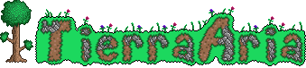
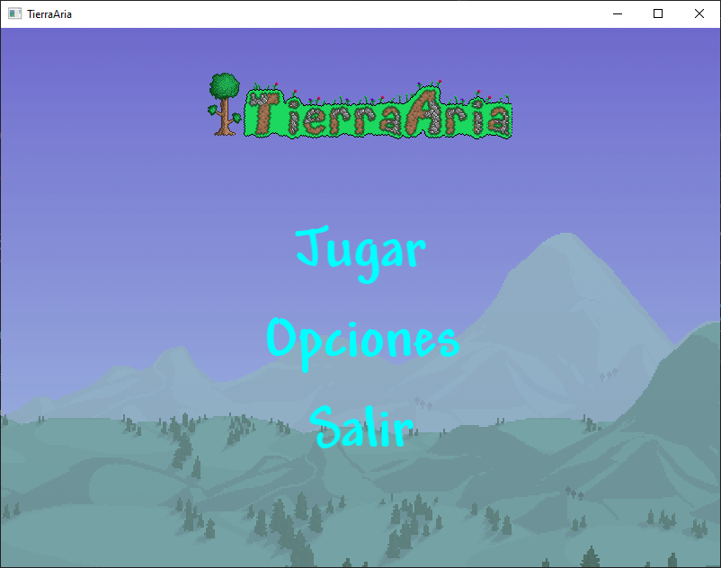
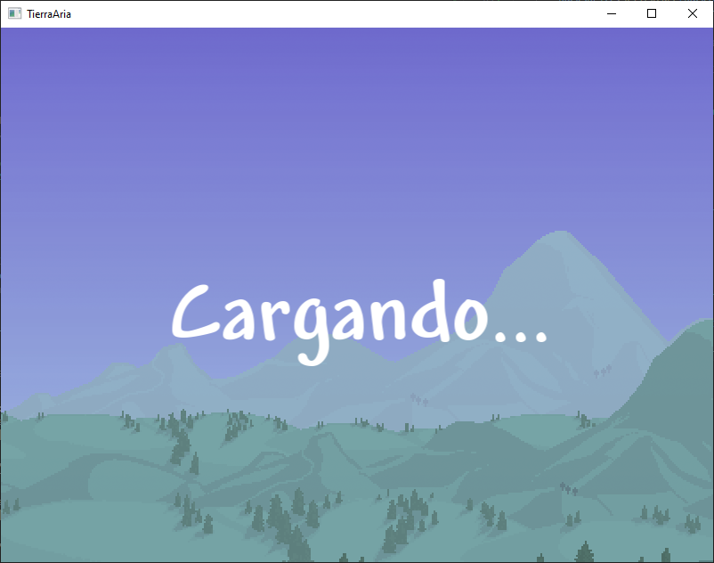
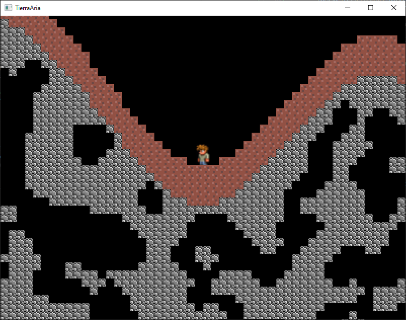

**Tierra Aria** es un pequeño proyecto inspirado en Terraria, que busca combinar elementos de exploración, construcción, artesanía, combate y minería en un videojuego de acción-aventura y sandbox. Los jugadores comienzan en un mundo generado proceduralmente y deben reunir recursos, construir estructuras, y luchar contra diversas criaturas y jefes. Tierra Aria es conocido por su estilo de gráficos pixelados en 2D y su enfoque en la creatividad y la libertad del jugador para explorar y modificar el entorno.





## Video demostracion
https://github.com/Maxller/Terraria/assets/89055172/a6bd0e56-0307-4355-848d-7b17433c2932

## Objetivos del Desarrollo

1. **Objetivo 0.1**: Movimientos básicos del personaje principal completos
2. **Objetivo 0.2**: Creación del mundo
3. **Objetivo 0.3**: Interacción entre el jugador y el mundo
4. **Objetivo 0.4**: Creación de NPC
5. **Objetivo 1.0**: Interacción entre el jugador y los NPC

## Estructura del Proyecto

- `bin/` - Contiene los ejecutables del proyecto
- `src/` - Contiene el código fuente
- `include/` - Archivos de cabecera
- `assets/` - Contiene los recursos del proyecto
- `docs/` - Contiene la documentación del proyecto

## Información para el Programador

Para compilar el proyecto necesitas instalar algunas librerías. Se recomienda instalar las librerías mediante [MSYS2](https://www.msys2.org/). Asegúrate de instalar los paquetes en MINGW64 y no en UART64, de lo contrario el proyecto no compilará.

**Librerías necesarias:**
- [SFML](https://packages.msys2.org/package/mingw-w64-x86_64-sfml)

### Instrucciones de Compilación

```sh
# Instalar las librerías necesarias en MINGW64
pacman -S mingw-w64-x86_64-gcc mingw-w64-x86_64-sfml

# Compilar y Ejecutar el proyecto 
make run
```
###Clases Creadas Hasta el Momento
- `Bloque.hpp` - Propiedades de los bloques del juego
- `Camara.hpp` - Muestra en pantalla una porción del mundo
- `Juego.hpp` - Estructura principal del motor del juego
- `Jugador.hpp` - Gestiona las acciones del jugador
- `Menu.hpp` - Pantalla de menú
- `Mundo.hpp` - Creación del mundo
- `Objeto.hpp` - Clase abstracta para todos los objetos renderizables
- `Personaje.hpp` - Gestiona la interacción del personaje

## Historial de Cambios

### Cambios 0.0.1

- Creación de la clase Juego, sigue en desarrollo.
- Implementación de un gameloop básico en el main utilizando la clase Juego.
- Creación de la clase Objetos, usada para renderizar todos los objetos del juego, sigue en desarrollo.
- Creación de la clase Personaje, sigue en desarrollo.
- Creación de un Makefile para compilar y ejecutar el juego.
- Movimiento lateral básico agregado al personaje de pruebas.

### Cambios 0.0.2
- Pruebas con varios conceptos del juego, almacenadas en la carpeta "Borrar después".
- Agregado salto y caída al personaje de pruebas, aún con errores.
- Se agregaron varios aspectos interesantes.
- Implementación de la clase PerlinNoise para la generación procedural.
- Inicio de la generación de mundos, básica pero en desarrollo.
- Creación de un menú básico.
- Clases agregadas en esta versión:
-- PerlinNoise - Proporcionada por ChatGPT.
-- Bloque - Aún en desuso.
-- Camara - Aún en desuso.
-- Menu - En desarrollo y en espera de retroalimentación.
-- Mundo - En desarrollo, ya funciona lo básico.
- Agregada la carpeta Mundos para almacenar los mundos creados para jugarlos posteriormente.

### Cambios 0.0.3
- Implementación de nuevas clases y funcionalidades.
- Cambio en la lógica de movimiento, ahora se mueve la cámara en lugar del personaje.
- Se modificó la clase Mundo para cargar los bloques al inicio y corregir un bug al mover la cámara.
- Incremento en el tiempo de carga del mundo.

### Cambios 0.0.4
- Ningún objetivo completado al final, frustrante.
